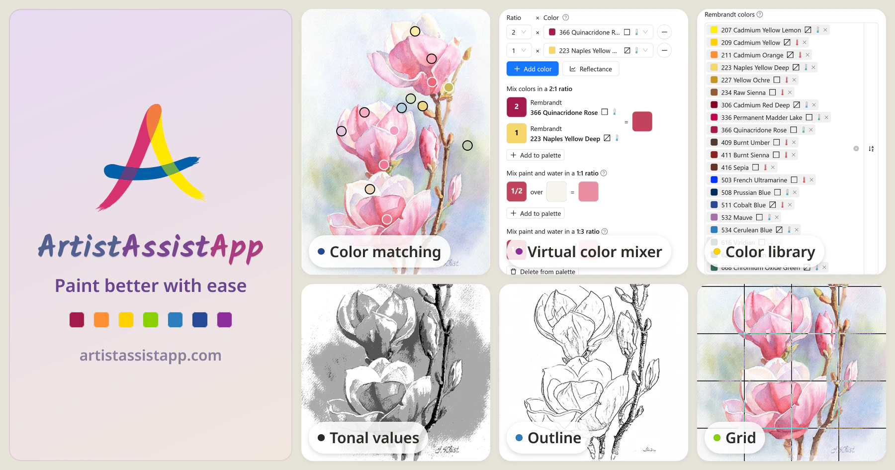
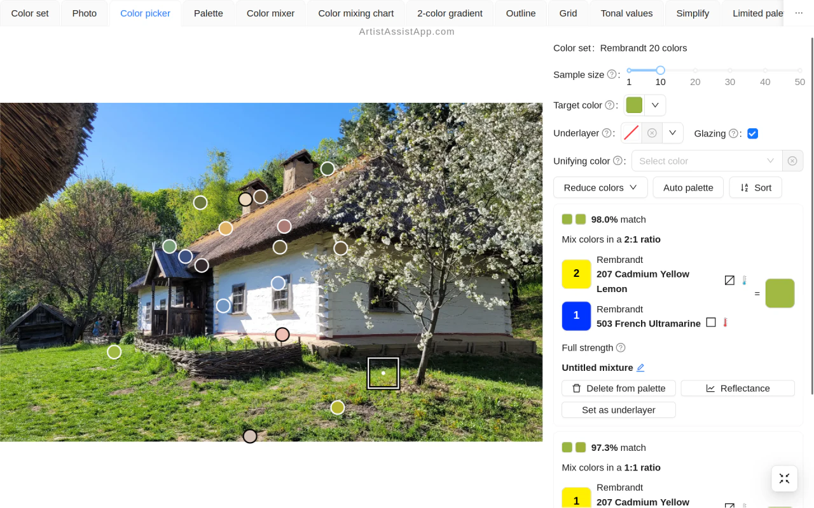
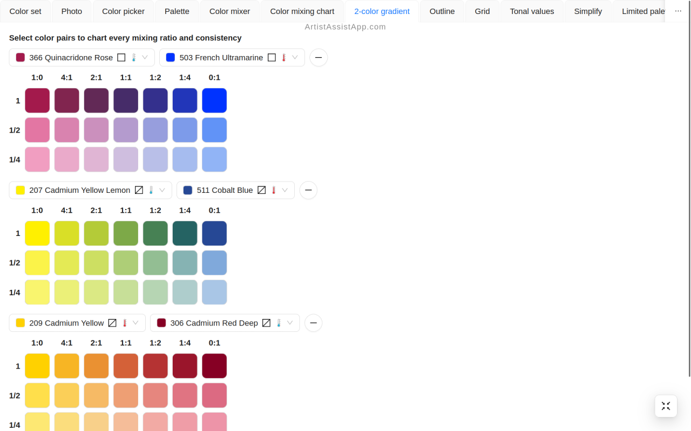
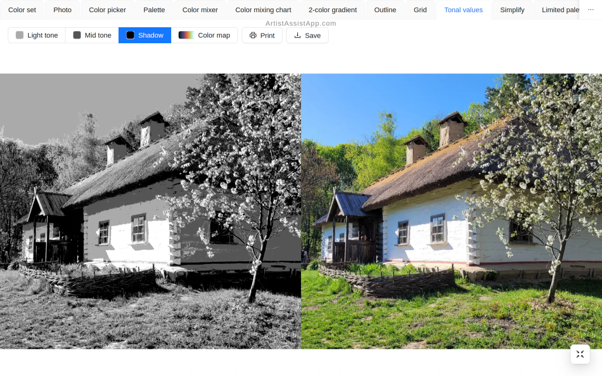
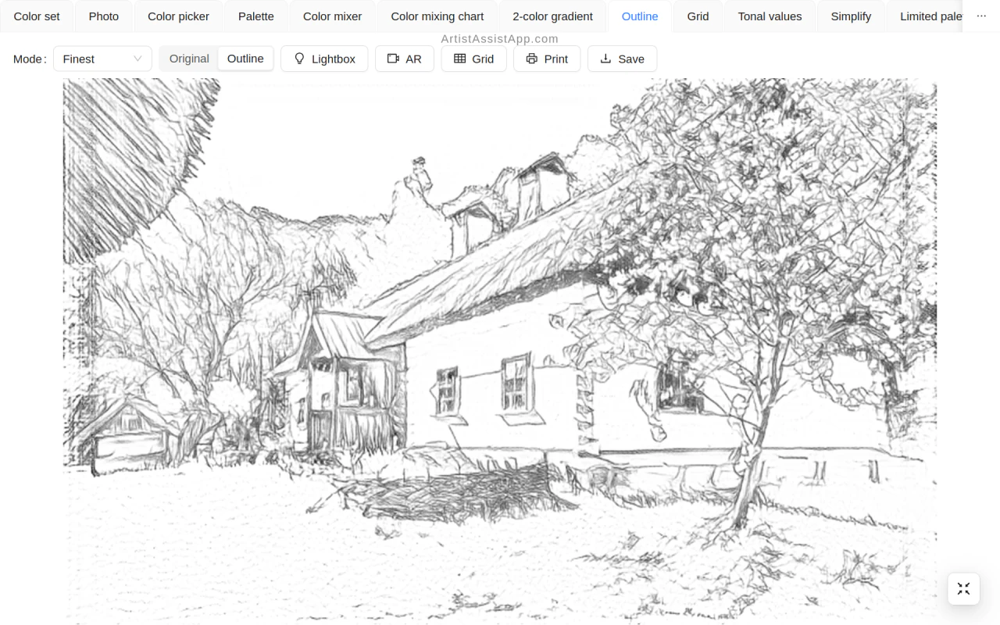

# ArtistAssistApp

- [Overview](#1)
- [Getting Started](#2)
- [Implementation details](#3)
- [Screenshots](#4)
- [License](#5)

<!-- Table of contents is made with https://github.com/eugene-khyst/md-toc-cli -->

## Overview

**ArtistAssistApp**, also known as **Artist Assist App**, is a Progressive Web App (PWA) that helps artists mix colors to match reference photos using their own art supplies. Create palettes and mixing charts, study tonal values, simplify photos into painting references, make outlines to trace, draw with grids, and work in limited palettes. Apply artistic styles, compare photos side by side, and edit reference photos or photos of finished paintings.

ArtistAssistApp offers the following features:

- Pick a color in your reference photo and find a matching color or paint mixture from your own set, with a match percentage
- Mix colors from different brands in any proportions and preview the result before using real paint
- Preview glazing over a dried layer or blending over an existing pastel layer
- See how much of the layer below shows through each paint, based on the manufacturer's transparent-to-opaque rating
- Add a unifying color to suggested mixtures for a more harmonious palette
- Generate, save, and print a color mixing chart from any subset of your colors to plan mixes without wasting paint
- Create two-color gradient charts to compare mixing ratios and consistencies for selected color pairs
- Choose your colors from a library of 250+ watercolor, oil, acrylic, gouache, pastel, pencil, and marker brands
- Create a custom color brand by sampling a photo of a hand-painted color chart
- Automatically build a palette from a photo with the best matching color mixtures
- Save favorite mixtures in a common palette or a separate palette for each photo
- Share color sets through links and QR codes
- Convert a photo into a clean outline to trace: print at any size on your home printer, use a tablet or laptop as a light box, or overlay it on your drawing surface with AR
- Add a square or rectangular grid, with optional diagonals, to your reference photo for accurate proportions
- Study light, mid, and shadow tones, or use a color map, to check contrast
- Simplify a photo into a painting reference with fewer small details, gently near the focal point you choose and more strongly away from it
- Preview a photo with a limited palette to check color harmony, then use that palette as your main color set
- Apply built-in artistic styles or a style from your own image to a photo
- Turn a photo into a loose brushstroke painting
- Compare photos side by side and rank them in pairs to pick the best reference
- Straighten a photo of your painting and correct its perspective, with automatic detection of the painting's corners
- Adjust white balance, levels, gamma, saturation, and color temperature to make a photo of a painting match the original
- Crop a photo freely or to a fixed aspect ratio
- Expand the canvas beyond the original frame and fill the new area with a color or generated content
- Remove backgrounds from reference photos or photos of your paintings
- Remove unwanted objects from a reference photo
- Upscale a photo to two or four times its width and height, depending on its size
- Remove noise and grain from a scanned or high-ISO photo
- Reduce camera shake and motion blur in a photo
- Colorize black-and-white photos
- Sync color sets, reference photos, saved color mixtures, and custom color brands across devices using your own Google Drive, OneDrive, or Dropbox
- Back up and restore the same data locally with ZIP files
- Install the app on your phone, tablet, or computer for offline access

All image processing runs in your browser. Photos stay on your device unless you choose to use cloud sync.

Try it now at [ArtistAssistApp.com](https://artistassistapp.com)

## Getting Started

- Go to [ArtistAssistApp.com](https://artistassistapp.com/).
- [Watch the video tutorials](https://artistassistapp.com/en/tutorials/).
- Join on [Patreon](https://www.patreon.com/ArtistAssistApp), then log in with Patreon or an email code.
- Want to contact us? [Find our contacts](https://artistassistapp.com/contact/).

## Implementation details

ArtistAssistApp does not depend on any third-party math or color library. Conversions between sRGB, linear RGB, CIE XYZ, CIE Lab and Oklab/Oklch, the reflectance-to-sRGB matrix and the luminance weights are all generated from the CIE 1931 2° observer, the D65 illuminant and the sRGB primaries, so the GPU and the TypeScript paths cannot disagree. Color mixing is subtractive and spectral: sRGB is reconstructed into a reflectance curve, mixed with an empirical model based on the Kubelka-Munk theory, and candidate mixtures are ranked by perceptual similarity and shown as a match percentage. Warm and cool follow the painter's rule - a pigment is warm or cool by the way it leans off its own primary in Oklch, so a blue leaning red is warm while a red leaning blue is cool. The colors of the visible spectrum and of black-body radiators come from the same CIE data, as generated tables rather than curve fits.

Reflectance reconstruction uses an independent implementation of the LHTSS formulation described by Scott Allen Burns in [Generating Reflectance Curves from sRGB Triplets](https://arxiv.org/abs/1710.05732), solved as a bordered tridiagonal system with the Thomas algorithm and a 3×3 Schur complement. No code or constants from Burns's implementation are used.

For mediums that support physical mixing, such as watercolor, oil paint, acrylic or gouache, ArtistAssistApp suggests a matching color mixture for any target color. For pastels and pencils it suggests the closest matching color from your set. Watercolor, acrylic, oil paint, colored pencils and watercolor pencils also support optical mixing.

Image processing is a multi-pass WebGL pipeline: Lanczos and bilinear resampling, Gaussian blur, Kuwahara and radial-mask simplification, Sobel edge detection with dilation and a perceived-lightness threshold, tonal color maps, perceptual color matching, white balance, levels, saturation, temperature, and homography for perspective correction. Otsu thresholding, color quantization with blue-noise ordered dithering, distance-transform sampling-point detection for automatic palettes and Elo ranking from pairwise comparisons run on the CPU.

Neural models for background removal, line drawing, corner detection, style transfer, inpainting, colorization, denoising, deblurring and super-resolution run locally with ONNX Runtime Web on WebGPU or WebAssembly, downloaded on demand and cached; images leave the device only for cloud storage the user connects. Each model is a separate work under its own license; see [THIRD-PARTY-NOTICES.txt](public/THIRD-PARTY-NOTICES.txt).

ArtistAssistApp uses Web Workers for parallel processing and Service Workers for offline access.

## Screenshots

**Color matching**

**Two-color gradients**

**Tonal values**

**Outlines**

## License

ArtistAssistApp is licensed under the GNU Affero General Public License v3.0. See
[LICENSE](LICENSE).

The machine-learning models the app downloads and runs are separate works, each under its own
license. See [THIRD-PARTY-NOTICES.txt](public/THIRD-PARTY-NOTICES.txt), also served at
[app.artistassistapp.com/THIRD-PARTY-NOTICES.txt](https://app.artistassistapp.com/THIRD-PARTY-NOTICES.txt).
